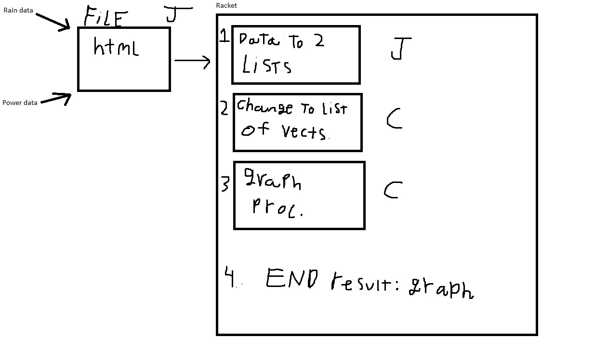

# PowerFromRain-
Modeling the correlation between rain fall and hydroelectric power generation in the Pacific Northwest using Racket and open data sets.  
### Statement
Describe your project. Why is it interesting? Why is it interesting to you personally? What do you hope to learn? 

### Analysis
Approaches from classes that will be used in the project will be using map to create a list of numbers from a list of strings, state-modification, closure, and recursion. 

### Data set or other source materials
If you will be working with existing data, where will you get those data from? (Dowload it from a website? access it in a database? create it in a simulation you will build....)

How will you convert that data into a form usable for your project?  

Do your homework here: if you are pulling data from somewhere, actually go download it and look at it. Explain in some detail what your plan is for accomplishing the necessary processing.

If you are using some other starting materails, explain what they are. Basically: anything you plan to use that isn't code.

### Deliverable and Demonstration
Explain exactly what you'll have at the end. What will it be able to do at the live demo?

What exactly will you produce at the end of the project? A piece of software, yes, but what will it do? Here are some questions to think about (and answer depending on your application).

It will extract data from html. The program will extract the data, and use it to graph the amount of rain by the amount of power produced. If I have time, later I will add extra features to allow the user to add new data to graph. Right now, it is not intended to be interactive. It will be shown to work when the user gets a graph. Right now, some of the lists can be shown. 

### Evaluation of Result How will you know if you are successful? 
If you include some kind of _quantitative analysis,_ that would be good.

## Architecture Diagram

The rain and power data will be written beforehand in html in the file. The procedures will extract the data from the html in the file, and move the data into two lists, one list being the rain data numbers, and the other list being the power data list. The two lists will be handed to a function which will convert them into list of vectors. Each vector will have two numbers, one a power data number, and the other a rain data number. The list will then be handed to a function which will use the list to create a scatterplot graph of the data. 

## Schedule
Explain how you will go from proposal to finished product. 

There are three deliverable milestones to explicitly define, below.

The nature of deliverables depend on your project, but may include things like processed data ready for import, core algorithms implemented, interface design prototyped, etc. 

You will be expected to turn in code, documentation, and data (as appropriate) at each of these stages.

Write concrete steps for your schedule to move from concept to working system. 

### First Milestone (Fri Apr 15)
First Milestone: A file filled with html should be turned in, along with procedures to extract the data from the file, and store it in the two lists. 

### Second Milestone (Fri Apr 22)
The second milestone will be procedures to convert the data in the two lists two a list of vectors which is needed for creating a scatter-plot, and procedures taking that transformed data and using it to create a 2d graph. 

### Final Presentation (last week of semester)
The project should be done at this point. We would simply add more features, such as perhaps adding another graph, and allowing the user to add data to be graphed.

## Group Responsibilities
I, John Kuczynski, will be creating the file with the html. I will also be creating the procedures to extract the data, and store it in two lists.

Here each group member gets a section where they, as an individual, detail what they are responsible for in this project. Each group member writes their own Responsibility section. Include the milestones and final deliverable.

